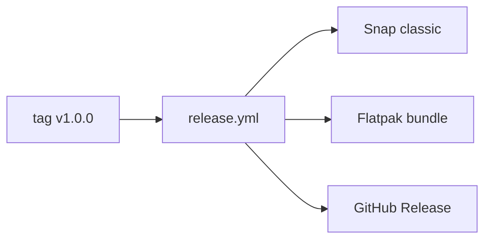

# Distribuição

## Responsabilidade

Mapear os artefatos Linux do `ab` e sua publicação automatizada.

## Componentes

- [PACKAGING.md](PACKAGING.md): Snap, Flatpak, atualização e release no GitHub.

## Relações

