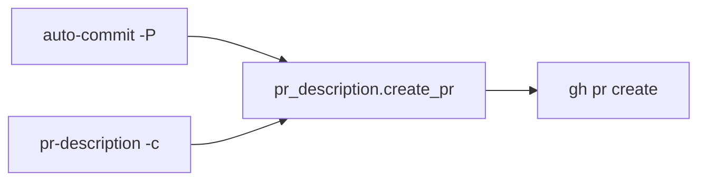

# Automação Git

## Responsabilidade

Documentar os fluxos que criam commits e pull requests pelo comando `ab`.

## Componentes

- [PR_DESCRIPTION.md](PR_DESCRIPTION.md): geração e reutilização de pull requests.

## Relações

