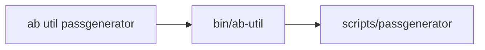

# Utilitários

## Responsabilidade

Mapear os utilitários locais expostos por `ab util`.

## Componentes

- [PASSGENERATOR.md](PASSGENERATOR.md): geração de senhas seguras.

## Relações

```mermaid
flowchart LR
  Command[ab util passgenerator] --> Dispatcher[bin/ab-util]
  Dispatcher --> Generator[scripts/passgenerator]
```
